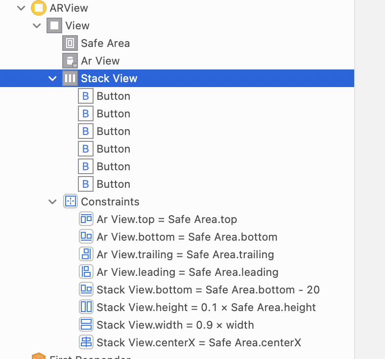
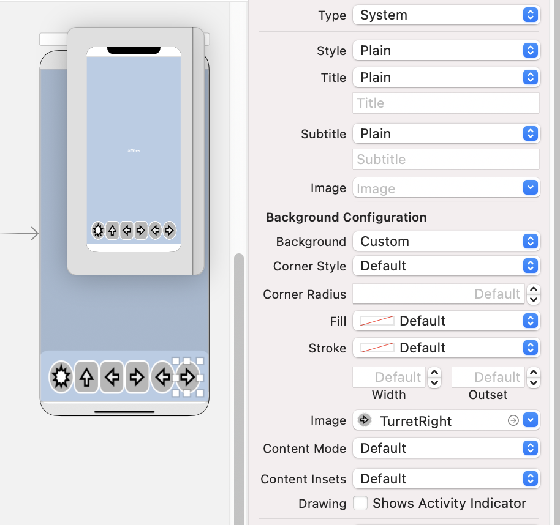
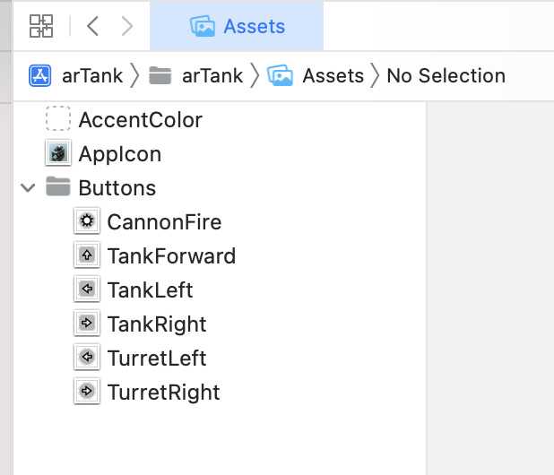

# iw09 ARKit之坦克构造

[点此查看演示视频](https://www.bilibili.com/video/BV113411x7Bq/)

创建Augmented Reality App，利用提供的素材将坦克显示在真实世界中（通过摄像头），并实现坦克的前进、左转、右转，炮台的左转、右转、开火功能按钮，可供用户操作。

## 技术细节

### UI

删除原有的AR view。添加新View，在新View中添加AR View和按钮的Stack View



对AR View添加占据整个View的约束。对Stack View添加“距离底部20”、“宽度为0.9倍”、“高度为0.1倍”、“水平居中”的约束。


Button其实还花了我一些时间，因为之前我都用的纯文字的Button。两个要点：



1. 图片应该作为Button的`Background Image`而不是`Image`

如果作为`Image`的话，图片完全不理会Button实际大小的限制，不会进行缩放，自己原本多大就显示多大。

2. `Title`全部留空

如果`Title`不为空的话，Autolayout会根据Title来判断需要的宽度，一些文字长的图片就会被拉宽，文字短的图片会被拉窄。并且文字也是不必要的元素，覆盖在图片上影响显示效果。

### 图片资源

向assets中拖拽添加AppIcon（注意大小对应）、整个Buttons文件夹拖入作为资源文件



### 控制坦克

ViewController添加以下成员：

```swift
    @IBOutlet var arView: ARView!
    var tankAnchor: TinyToyTank._TinyToyTank?
    var isActionPlaying: Bool = false
```

`arView`如名字所示；`tankAnchor`为实际控制的坦克，`isActionPlaying`标示当前坦克是否正在动画播放中


在View加载时进行以下初始化：

```swift
    override func viewDidLoad() {
        super.viewDidLoad()
        
        tankAnchor = try! TinyToyTank.load_TinyToyTank()
        tankAnchor?.turret?.setParent(tankAnchor?.tank, preservingWorldTransform: true)
        tankAnchor?.actions.actionComplete.onAction = { _ in
            self.isActionPlaying = false
        }
        arView.scene.anchors.append(tankAnchor!)
    }
```

首先，加载一个坦克。然后设定坦克的炮台。接着重写坦克的动画播放完成时应执行的操作（此处为将坦克标记为不在播放动画）。最后将坦克加入ar view


对于按键点击事件的响应：

```swift
    @IBAction func forwardTouched(_ sender: Any) {
        guard isActionPlaying == false else {
            return
        }
        isActionPlaying = true
        tankAnchor?.notifications.tankForward.post()
    }
```

首先确认当前没有在播放动画。如果正在播放动画则忽略此次点击。

将坦克标记为播放动画中后执行前进动作。

## 问题及解决方案

#### 缺少依赖资源导致编译失败

坦克中的音效实现需要相关资源包。相关资源在Development Tools中并未自带，编译app时会因为找不到资源而报错中断。

在Reality Composer中打开坦克模型，右上角的 信息Info 处提示缺少资源，点击全部下载即可